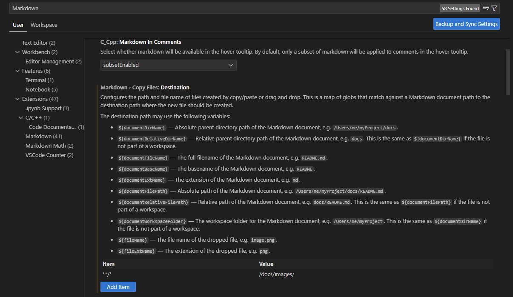

### How to easily add pictures to your mark down files

While doing some research on how to speed up the creation of docs I found this post on [Stackoverflow](https://stackoverflow.com/questions/75831497/how-can-i-paste-images-into-my-markdown-files-in-vs-code)

### Use case:

You want to paste a picture into a markdown file. You take a screen shot and then you paste it into the mark-down file.

If you are doing it from VS Code, there is a setting that enables it to automatically grab that picture you have in the clipboard and save it into a specified folder.

For this project I'm savings the images under /docs/images/

