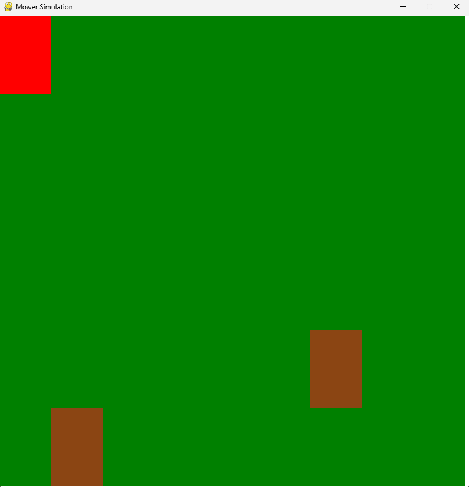
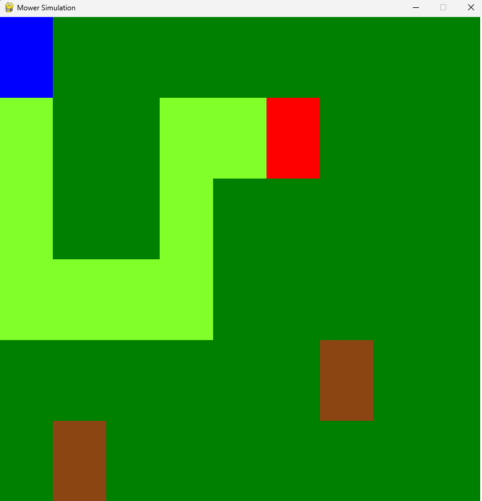
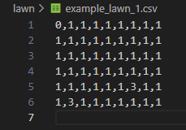
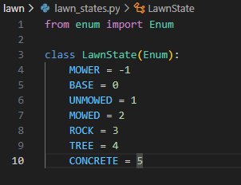

### Use case of pygame

For our current needs we need a tile system. The following is a [proof of concept](/simulation/example_tiles.py) on how to implement one.

In this case, the red block represents the mower and it can be controlled using the arrow keys or a,w,s,d keys for the first person shooter guys.

Here you can see the trail of cut grass (bright green)

The program reads the lawn info from a CSV file:

And the possible states of a tile are given by this enum:

